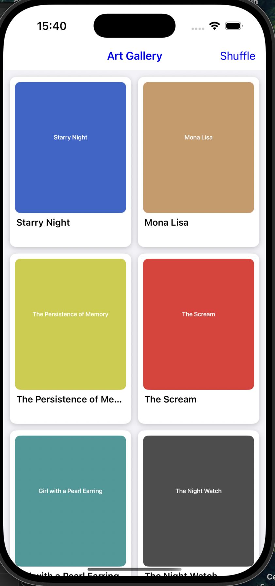
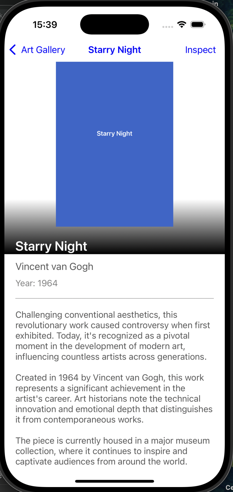

# 🎨 ArtworkApp

**ArtworkApp** is a demonstration iOS application that displays a gallery of artworks with animated transitions, asynchronously generated placeholder images, and runtime method injection using Objective-C.

---

## 📱 Features

- UICollectionView with custom `ArtworkCell` layout
- Tapping an artwork reveals a detailed view with animated transition
- Asynchronous image generation and loading using `NSOperationQueue`
- Image caching using `NSCache`
- Image loading cancellation via `didEndDisplayingCell`
- Shuffle button powered by Objective-C runtime (adds method at runtime)

---

## ⚙️ Technical Highlights

### 💾 Asynchronous Image Loading

- Placeholder images are dynamically generated with color and title
- `NSBlockOperation` used to simulate image loading
- Operations stored in `imageOperations` dictionary to support cancellation
- Loaded images are cached in `NSCache` using artwork titles as keys

### 🧠 Runtime Method Injection

- `class_addMethod` is used to dynamically add a `dynamicShuffleArtworks` selector to `GalleryViewController`
- Method is invoked by a `UIBarButtonItem` titled "Shuffle"
- When triggered:
  - Shuffles the artworks array
  - Reloads the collection view with fade animation
  - Displays a confirmation alert

---

## 🧩 Project Structure

```
ArtworkApp/
├── Models/
│   └── Artwork.h/.m
├── Views/
│   └── ArtworkCell.h/.m
├── Controllers/
│   ├── GalleryViewController.h/.m
│   └── ArtworkDetailViewController.h/.m
├── Resources/
│   └── Assets.xcassets / Info.plist / LaunchScreen.storyboard
```

---

## 🛠 Requirements

- iOS 15.0+
- Xcode 15.0+
- Compatible with both simulator and device

---

## 🚀 Getting Started

1. Clone the repository:
   ```bash
   git clone https://github.com/yourusername/ArtworkApp.git
   ```
2. Open `ArtworkApp.xcodeproj` in Xcode.
3. Build and run on a simulator or physical device.

---

## 🧪 TODO

- Integrate real API for artwork data
- Add support for favoriting artworks
- Add zoom gesture in detail view
- Use Core Data for persistent local storage

---
<p align="center">
    
  <br/>
 
</p>
## 👨‍💻 Author

Developed by [Vlad](https://github.com/Vlad-tdk)  
Tech: Objective-C, UIKit, Runtime API
